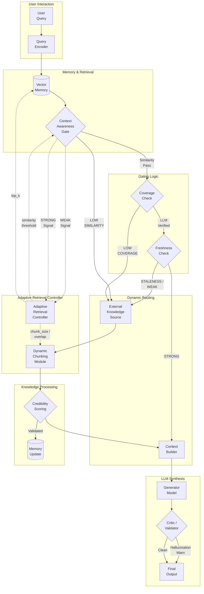

# Agentic RAG Architecture

```mermaid
graph TD
    subgraph UI ["User Interaction"]
        User["User<br/>Query"] --> QE["Query<br/>Encoder"]
    end

    subgraph MR ["Memory & Retrieval"]
        QE --> VM[("Vector<br/>Memory")]
        VM --> CAG{"Context<br/>Awareness<br/>Gate"}
    end

    subgraph ARC_Sub ["Adaptive Retrieval Controller"]
        ARC["Adaptive<br/>Retrieval<br/>Controller"]
        ARC -.->|"similarity<br/>threshold"| CAG
        ARC -.->|"top_k"| VM
        ARC -.->|"chunk_size /<br/>overlap"| DCM
    end

    subgraph GL ["Gating Logic"]
        CAG -->|"Similarity<br/>Pass"| Cov{"Coverage<br/>Check"}
        Cov -->|"LLM<br/>Verified"| Fresh{"Freshness<br/>Check"}
    end

    subgraph DR ["Dynamic Routing"]
        Fresh -->|"STALENESS /<br/>WEAK"| EKS["External<br/>Knowledge<br/>Source"]
        CAG -->|"LOW<br/>SIMILARITY"| EKS
        Cov -->|"LOW<br/>COVERAGE"| EKS
        
        Fresh -->|"STRONG"| CB["Context<br/>Builder"]
    end

    subgraph KP ["Knowledge Processing"]
        EKS --> DCM["Dynamic<br/>Chunking<br/>Module"]
        DCM --> Cred{"Credibility<br/>Scoring"}
        Cred -->|"Validated"| MU[("Memory<br/>Update")]
        Cred --> CB
    end

    subgraph LS ["LLM Synthesis"]
        CB --> GEN["Generator<br/>Model"]
        GEN --> VAL{"Critic /<br/>Validator"}
        VAL -->|"Hallucination<br/>Warn"| FO["Final<br/>Output"]
        VAL -->|"Clean"| FO
    end

    %% Feedback loop
    CAG -.->|"WEAK<br/>Signal"| ARC
    CAG -.->|"STRONG<br/>Signal"| ARC
```
