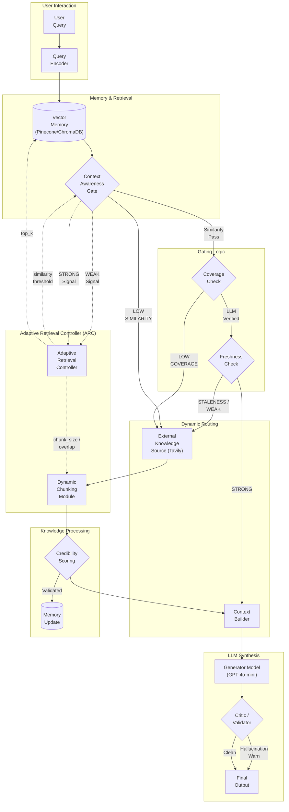

<div align="center">

# 🧠 ACARA — Adaptive Context-Aware Retrieval Agent

**A self-optimizing, agentic RAG pipeline for medical question answering**

[](https://python.org)
[](https://fastapi.tiangolo.com)
[](https://react.dev)
[](https://www.langchain.com)
[](https://openai.com)
[](LICENSE)

</div>

---

## 🔴 Problem Statement

Traditional Retrieval-Augmented Generation (RAG) systems suffer from several critical limitations when deployed in high-stakes domains like **medical AI**:

| Problem | Impact |
|---|---|
| **Static retrieval parameters** | Fixed `top_k` and similarity thresholds fail when query complexity varies widely |
| **No context quality gating** | Irrelevant or outdated chunks are passed to the LLM, causing hallucinations |
| **No freshness awareness** | Stale medical knowledge from old documents is used without warning |
| **No web fallback** | If the vector store lacks an answer, the system either hallucinates or says "I don't know" |
| **No credibility filtering** | Web-retrieved content is fed to the LLM blindly, regardless of reliability |
| **No self-correction** | Hallucinated medical answers reach the user without any validator or warning |
| **No pipeline observability** | Users and developers have no visibility into what retrieval path was taken |

> **Core question**: *How can a RAG system dynamically adapt its retrieval strategy based on context quality, rather than using fixed, one-size-fits-all parameters?*

---

## ✅ Solution — ACARA

**ACARA (Adaptive Context-Aware Retrieval Agent)** is a fully agentic RAG pipeline that solves each of these problems through a set of intelligent, interconnected modules:

- **Adaptive Retrieval Controller (ARC)** — dynamically tunes `top_k`, `similarity_threshold`, and `chunk_size` based on real-time feedback signals from the pipeline
- **Context Awareness Gate (CAG)** — a 3-layer gate that checks *similarity*, *coverage*, and *freshness* before routing to the generator or triggering a web fallback
- **Dynamic Chunking Module** — ARC-driven chunk sizing based on query complexity (longer queries → smaller, more focused chunks)
- **External Knowledge Source** — Tavily-powered real-time web search as a fallback when the vector store is insufficient
- **Credibility Scoring** — LLM-based credibility check before saving web chunks to long-term memory
- **Critic / Validator** — built into the generator via structured output, flags hallucinations in real-time
- **SSE Pipeline Visualizer** — live, step-by-step pipeline transparency via Server-Sent Events

---

## 🏗️ System Architecture



---

## ⚙️ How It Works — Step by Step

### 1. 🔍 Query Encoding & Vector Retrieval
- User query is embedded using **OpenAI `text-embedding-3-small`**
- ARC provides the current `top_k` value to the vector store query
- If the initial search is weak (low cosine similarity), **Lazy Query Expansion** fires: the LLM generates 3–4 medical synonyms and retries the search

### 2. 🧩 Context Awareness Gate (CAG) — 3-Layer Check
The gate is the core decision node that routes the pipeline:

| Check | Method | Pass Condition |
|---|---|---|
| **Similarity** | Cosine distance vs ARC threshold | Best score ≥ `similarity_threshold` |
| **Coverage** | LLM judge (GPT-4o-mini) | LLM scores context as "adequate" for query |
| **Freshness** | ISO timestamp age check | < 72 hours since ingestion (configurable) |

- **All 3 pass** → Context is **STRONG** → route to Generator
- **Any check fails** → Context is **WEAK** → route to External Knowledge Source

### 3. 🔄 Adaptive Retrieval Controller (ARC) — Self-Optimization
ARC is a **thread-safe singleton** that continuously learns from pipeline outcomes:

| Signal | Action |
|---|---|
| Context WEAK | Lower `similarity_threshold` by 0.05 (broaden recall) + increase `top_k` by 1 |
| Context STRONG | Tighten `similarity_threshold` by 0.02 + decay `top_k` back toward 3 |
| Long query (>20 words) | Decrease `chunk_size` by 500 (more focused chunks) |
| Short query (<6 words) | Increase `chunk_size` by 500 (broader context per chunk) |

### 4. 🌐 External Knowledge Source + Dynamic Chunking
- Triggered when CAG detects weak context
- **Tavily Search API** fetches live web results (top 5)
- Retrieved text is chunked with **ARC-adaptive** `chunk_size` and `chunk_overlap` (semantic-aware, sentence-boundary splits)

### 5. ✅ Credibility Scoring + Memory Update
- Each web chunk is scored by an LLM judge: *"Should this be trusted and saved?"*
- Credible chunks are **batch-evaluated in parallel** (LangChain `.batch()`)
- Credible chunks are upserted into the vector store with a freshness timestamp for future reuse

### 6. 🤖 Generation + Critic/Validator
- **Context Builder** deduplicates and ranks chunks, prepending source metadata
- **GPT-4o-mini** generates a structured response with two fields:
  - `answer` — the clinical response
  - `hallucination_flagged` — `True` if the answer contains unsupported claims
- If flagged, the answer is annotated with a ⚠️ validator warning

### 7. 📡 Real-Time Pipeline Observability (SSE)
- The frontend subscribes to the `/stream-chat` Server-Sent Events endpoint
- Each pipeline step (`retrieve`, `grade`, `web_search`, `chunk`, `credibility`, `generate`, `done`) emits a live event
- The UI renders a real-time pipeline visualizer showing exactly which path the agent took

---

## 🆚 ACARA vs. Baseline RAG — Benchmark Results

Evaluated on a **500-question medical QA dataset** using **DeepEval (RAGAS Answer Correctness metrics)** with GPT-4o-mini as the judge:

| Metric | Baseline RAG | ACARA | Δ |
|---|---|---|---|
| **Answer Accuracy** | 44.6% | **77.4%** | +32.8% |
| **Retrieval Precision** | 95.8% | **97.9%** | +2.1% |
| **Hallucination Rate** | N/A (no validator) | **0.0%** | — |
| **Avg Latency** | ~2.3s | ~6.5s | +4.2s |

> *Small latency cost for significantly higher accuracy and safety. The hallucination validator makes ACARA safer for medical use.*

---

## 🧱 Project Structure

```
ACARA/
├── backend/                    # FastAPI backend
│   ├── main.py                 # API routes (chat, upload, ARC, SSE)
│   ├── agent.py                # Full LCEL pipeline (retrieve → grade → branch → generate)
│   ├── arc.py                  # Adaptive Retrieval Controller (thread-safe singleton)
│   ├── database.py             # Vector store abstraction (Pinecone / ChromaDB)
│   ├── models.py               # Pydantic request/response models
│   ├── eval_benchmark.py       # Evaluation benchmark (ACARA vs Baseline)
│   ├── eval_testset.py         # 500-question medical QA test set
│   ├── visualize_3d.py         # 3D vector space visualization (Plotly)
│   └── requirements.txt        # Python dependencies
│
├── frontend/                   # React + Vite frontend
│   ├── src/
│   │   ├── App.jsx             # Main chat UI with SSE pipeline visualizer
│   │   ├── ARCPanel.jsx        # Live ARC parameter display
│   │   ├── PipelineVisualizer.jsx  # Real-time pipeline step visualizer
│   │   ├── UploadPanel.jsx     # PDF / text document upload
│   │   ├── index.css           # Full design system (dark mode, animations)
│   │   └── config.js           # API URL configuration
│   ├── package.json
│   └── vite.config.js
│
├── ARCHITECTURE.md             # Mermaid architecture diagram
├── render.yaml                 # One-click Render.com deployment config
├── acara_architecture_viz.html # Interactive 3D architecture visualization
└── comparison_chart.html       # Baseline vs ACARA benchmark chart
```

---

## 🚀 Quick Start

### Prerequisites
- Python 3.10+
- Node.js 18+
- OpenAI API key
- Tavily API key
- MongoDB URI (Atlas free tier works)
- Pinecone API key *(optional — falls back to local ChromaDB)*

### Backend Setup

```bash
cd backend
python -m venv venv
source venv/bin/activate          # Windows: venv\Scripts\activate
pip install -r requirements.txt

# Copy and fill in your API keys
cp .env.example .env
# Edit .env with your keys

uvicorn main:app --reload --port 8000
```

### Frontend Setup

```bash
cd frontend
npm install

# Set backend URL
echo "VITE_API_URL=http://localhost:8000" > .env

npm run dev
```

### Environment Variables

#### Backend (`backend/.env`)
```env
OPENAI_API_KEY=your_openai_key
TAVILY_API_KEY=your_tavily_key
MONGODB_URI=your_mongodb_connection_string
PINECONE_API_KEY=your_pinecone_key      # optional
PINECONE_INDEX_NAME=acara-index          # optional
```

#### Frontend (`frontend/.env`)
```env
VITE_API_URL=http://localhost:8000
```

---

## 🌐 Deploy to Render (One-Click)

The `render.yaml` in the root directory configures both the backend and frontend as separate Render services:

1. Push this repo to GitHub
2. Go to [render.com](https://render.com) → New → Blueprint
3. Connect your repo → Render auto-detects `render.yaml`
4. Add environment variables in the Render dashboard
5. Deploy!

---

## 📊 Evaluation Benchmark

Run the full ACARA vs Baseline evaluation:

```bash
cd backend
# LLM-judge mode (GPT-4o-mini, recommended)
python eval_benchmark.py --n 500 --mode llm

# Exact-match mode (faster, no API cost)
python eval_benchmark.py --n 500 --mode exact

# Custom dataset (JSONL with 'question' and 'answer' keys)
python eval_benchmark.py --dataset your_dataset.jsonl --n 500
```

---

## 🔌 API Reference

| Endpoint | Method | Description |
|---|---|---|
| `/` | GET | Health check |
| `/chat` | POST | Standard chat (JSON response) |
| `/stream-chat` | POST | SSE streaming chat with pipeline events |
| `/history/{session_id}` | GET | Retrieve chat history |
| `/sessions` | GET | List all sessions |
| `/session/{session_id}` | DELETE | Delete a session |
| `/upload` | POST | Upload raw text to vector store |
| `/upload-pdf` | POST | Upload PDF file to vector store |
| `/arc-status` | GET | Get current ARC parameters |
| `/arc/reset` | POST | Reset ARC to defaults |
| `/stats` | GET | Vector store statistics |

---

## 🛠️ Tech Stack

| Layer | Technology |
|---|---|
| **LLM** | OpenAI GPT-4o-mini |
| **Embeddings** | OpenAI `text-embedding-3-small` |
| **Orchestration** | LangChain LCEL (RunnableSequence + RunnableBranch) |
| **Web Search** | Tavily Search API |
| **Vector Store** | Pinecone (cloud) / ChromaDB (local fallback) |
| **Chat History** | MongoDB Atlas (Motor async driver) |
| **Backend** | FastAPI + Uvicorn |
| **Frontend** | React 19 + Vite |
| **Streaming** | Server-Sent Events (SSE) |
| **Evaluation** | DeepEval (GEval metric) |
| **Deployment** | Render.com |

---

## 📝 License

All Rights Reserved — see [LICENSE](LICENSE) for details. This project is proprietary and cannot be copied, distributed, or modified without express written permission.

---

<div align="center">

Built with ❤️ by [Gourab Dutta](https://github.com/GourabDutta-22)

</div>
